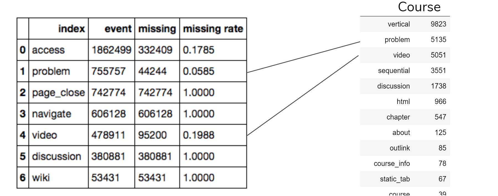
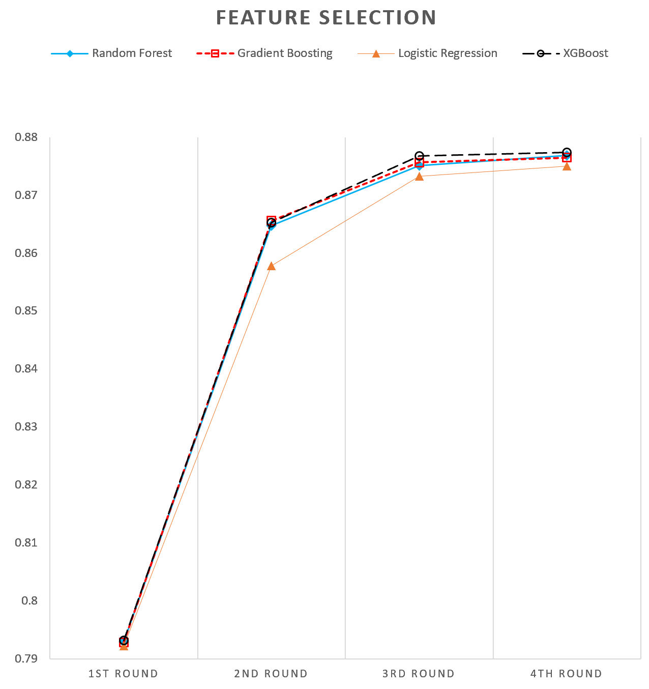
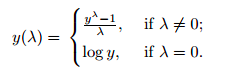
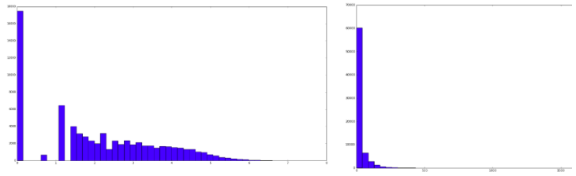
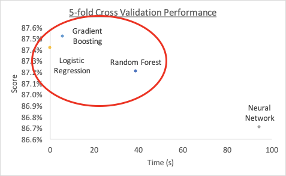

# Drop-MOOC-Prediction

> Author: Kang Youwen | Zou Haoxiang | Hu Haoyang

> In this project ([KDD Cup 2015](http://www.kddcup2015.com/information-introduction.html)), we build predictive models to predict whether a student will drop a course or not by using information mined from the given data.

<br>

* [Overview](#Overview)
* [About Data](#About-Data)
* [Feature Engineering](#Feature-Engineering)
* [Data Preprocessing](#Data-Preprocessing)
* [Classification](#Classification)
    * [Model Selection](#Model-Selection)
    - [Parameters Optimization](#Parameters-Optimization)
    - [Improved Gradient Boosting - XGBoost](#Improved-Gradient-Boosting-XGBoost)
    - [Classifier Voting](#Classifier-Voting)
- [Results](#Results)
- [Evaluation](#Evaluation)
    - [Imbalance Data](#Imbalance-Data)
    - [Ablation Analysis](#Ablation-Analysis)
- [Appendix](#Appendix)
    - [References](#References)
    - [Team info & Work distribution](#Teamwork)

<br>

## Overview

```
|-- read_data.py			# Read Data from data/
|-- preprocess.py			# Feature Extraction and data processing
|-- main.py				# Biuld Classifiers to make prediction
|-- demo.ipynb
|-- data
|   |-- DataDescription.txt		# Data discription
|   |-- date.csv
|   |-- object.csv
|   |-- train				# training data
|   |   |-- enrollment_train.csv
|   |   |-- log_train.csv
|   |   |-- truth_train.csv
|   |-- object.csv			# testing data
|   |   |-- enrollment_test.csv
|   |   |-- log_test.csv
|   |   |-- truth_test.csv
```
<br>

Prerequisites
```
Python (>= 2.7 or >= 3.4)
NumPy (>= 1.8.2)
SciPy (>= 0.13.3)
```
```
pip install pandas
pip install -U scikit-learn
pip install xgboost
```
<br>

Running Prediction

```
python main.py
```
<br>

## About-Data

* The data sets are sourced from KDD Cup 2015, contains course date, course object, enrollment, event log, and truth label information. Value of most information is encrypted and has no literal meaning. Overall, the dataset can be divided into 4 parts:
  * Course information (date.csv & object.csv)
    * It contains the information for all the 39 courses, describing the date and components information:
    	> Module: <course_id, module_id, category, children, start>
    	> Course: <course_id, start_date, end_date>
  * Enrollment event log (log_train/test.csv)
    * It records all the event generated by each user when visiting the course website, describing the behavior of the user  by time series:

      > Event: <enrollment_id, event_time, source, event_type, object_id>
    * Enrollment relationship (enrollment_train/test.csv)
    * It describes the relationship between users and courses. All the “links” are stored as an enrollment_id:

      > Enrollment: <course_id, enrollment_id, user_name>
  * Labels (truth_train/test.csv)
    * This is the truth labels for each enrollment id, shows whether a user drop the certain course (1=dropout, 0=keep enrolled)

      > Labels: <enrollment_id, label

<br>

## Feature-Engineering
After loading the data, we implemented 4 rounds of feature selection to get used of the information of the event log, time intervals, modules info, etc. We dived deep into the logic of the feature engineering each round and improve the cross-validation score of our models continuously.

* **Round 1: Basic user information**

  * The initial idea was to get some basic user profile data. However, there’s no direct user information provided. So, inspired by the potential relationship between the courses and users, we counted the courses per user enrolled and students per course using Enrollment() data.
* **Round 2: Event Activities**

  * We discovered there are different types of meaningful activities in Log() data, which occurrences could reflect the activity level of the user. And different kinds of events might have a different power of predicting. Thus, we counted the number of events for different types per enrollment_id, which gives 7 features in total. This feature boosted the cross-validation score to over 86%, which proved to be a useful set of features.
* **Round 3: Weekly Study Sessions**

  * By exploring the log event data, we further found there exists regularity by time series. Students tended to be more active at the beginning of enrollment and less active at the end. It’s reasonable that students who have decreased the activity level would drop the course. Thus, we wanted to find the activity levels by time series. Recalled that each course lasts 30 days, so we divided the time period into weeks(7 days). Moreover, we observed students would generate a lot of events in quick succession. The differences of quick accessing times might not reflect the study times per week. Thus, we use the concept of “Study Session” instead of counting the event numbers. A session contains multiple events with the min_span less than 1 hour, which means that the student was continuously studying in the same session period. By counting the weekly study sessions, we hoped to get how many times a student studied during the week. This set of features was proved to be useful by further boosting the cross-validation score.
* **Round 4: Study Coverage**
	* Up to now, we think the information in Log() data has been well used. But we ignored the differences between courses. The same activity level might be different regards different courses. We observed that the object attached to each event could be partially linked to the Course_Object() modules. Then, we explored the missing rate for different types of events.

	

    * As shown in the figure above, the missing values mostly happened in certain types (i.e. page_close, navigate, discussion, wiki). Also, the types of events could be linked to course modules types for problems and videos. Thus, for those two types of events, we could know the coverage of problem and videos that students have studied. So, we counted the unique modules that the students visited and divided by the number of problems and videos modules in the specific course respectively, to get the study coverage ratio of problems and videos. With the additional information extracted from Course_Object() data, we improved the cross-validation score further in the final round of feature selection.

<br>

The changing of cross-validation score in each round is shown in the plotting image below. After finding that the 1st round features really not helpful in performance, we only kept the 2nd - 4th round of features: 
* **event_count** (df): 2nd round feature - count the numbers of different types of events for each enrollment_id
* **weekly_session_count** (df): 3rd round feature - Numbers of sessions weekly(time_span of two sequential events is less than 1h in each session)
* **problem_video_ratio** (df): 4th round feature - calculate the study coverage of problems and videos in the course modules

	<div align=center>

<br>

## Data-Preprocessing

* Discretization
  * In the above feature engineering process, we’d already implemented data discretization by discretizing the time series data to counting values. Cutting time series into time intervals and values counting help us to implement this.

<br>

* Transformation
    * After we got the counting values of each attribute, we found that the distributions of all the features are quite left-skewed. Considering that skewness might create biases to the prediction result, we decided to carry out Box-cox transformation to deal with the features.
    * At the core of the Box-cox transformation is an exponent, lambda (λ), which varies from -5 to 5. All values of λ are considered and the optimal value for our data is selected for each of the features; The “optimal value” is the one which results in the best approximation of a normal distribution curve. The transformation of Y has the form:

    	<div align=center>

    * After the transformation, we can see that the distribution of features became less skewed which was positive to the prediction. 
    
	<div align=center>
	
	> Right - after transformation; Left - before transformation

<br>

## Classification
### Model-Selection
After finalizing three sets of features and conducting data discretization and transformation, the next step is to find 3 most suitable methods for voting. We tried 5 different methods to run the data and select 3 out of them based on both running time and 5-fold cross-validation score. 



<br>

| **Classifiers**         | **5-fold cross validation average** | **Time** | **Key parameters**             |
| -------------------------   | ----------------------------------- | -------- | -------------------------- |
| Random Forest       | 87.204%                             | 38.90    | n_estimators   = 500       |
| SVM                   	| 86.651%                             | 241.45   | Gamma =   ‘scale’          |
| Neural Network        | 86.702%                             | 94.58    | hidden_layer_sizes=(50,50) |
| Logistic Regression | 87.415%                             | 0.38     | (default parameters)     |
| Gradient Boosting   | 87.517%                             | 5.93     | (default parameters)   |

> SVM is not shown in the chart because it takes a too long time, yet its performance is still lowest among all methods.

<br>

We select Random Forest, Logistic Regression and Gradient Boosting since they perform better in both scoring and efficiency. 

<br>

### Parameters-Optimization

| **Classifier** |**Parameter candidates** |**Parameter settings** |**Optimal cross-validation   score** |
| -------------- | ------------------------ | ---------------------- | ------------------------------------ |
|Random Forest |n_estimators = [50, 100, 200]   max_depth = [6, 12, 18]   min_samples = [1, 2, 3] | n_estimators = 200   max_depth = 12   min_samples = 2 |0.8754 |
|Logistic Regression |tol = [1e-3, 1e-4, 1e-5]  C = [0.5, 1, 1.5] | tol = 1e-3  C = 1.5 |0.8743 |
|Gradient Boosting |n_estimators = [50, 100, 200]   max_depth = [6, 12, 18]   learning_rate = [0.01, 0.05. 0.1] |n_estimators = 200   max_depth = 6   learning_rate = 0.05 |0.8756 |

We tunned the parameters of the above classifiers using cross-validation scores.
* Random Forest
  * n_estimators: The number of trees in the forest. Increasing the value will raise the accuracy, but cost more time.
  * max_depth: The maximum depth of the tree. It turns out having proper limitations of the max_deplth can help improve the performance.
  * min_samples: The minimum number of samples required to split an internal node. Increasing the number will let the classifier rougher, and reduce overfitting. 

* Logistic Regression
  * tol: Tolerance for stopping criteria. It turns out there’s no much difference when tolerance decreasing. So we set the smallest one to accelerate the model.
  * C: Inverse of regularization strength. Like in support vector machines, smaller values specify stronger regularization. It turns out a slightly larger C gives a better result.

* Gradient Boosting
  * n_estimators: The number of boosting stages to perform. Gradient boosting is fairly robust to overfitting so a large number usually results in better performance.
  * learning_rate: learning rate shrinks the contribution of each tree by learning_rate. There is a trade-off between learning_rate and n_estimators.
  * max_depth: maximum depth of the individual regression estimators. The maximum depth limits the number of nodes in the tree.

<br>

### Improved-Gradient-Boosting-XGBoost
During our research, we notice that besides the Gradient Boosting available in scikit-learn, another boosting method called XGBoost (Extreme Gradient Boosting) may provide better results. Generally speaking, XGBoost is faster than Gradient Boosting but the latter could be used in more applications. Specifically, XGBoost adds a few tricks based on Gradient Boosting:

* Clever penalization of trees by the proportional shrinking of leaf nodes
In XGBoost, there is a varying number of terminal nodes in the decision trees. Left weights of the trees with less evidence are shrunk more heavily.

* Application of Newton Boosting
Newton-Raphson method of approximations are applied, which provides a direct route to the minia than gradient descent.

* Application of extra randomization parameter
Such randomization parameter can reduce the correlation between the trees. The lesser the correlation among classifiers, the better result we could get for ensembling them.

As we could see here, XGBoosting can provide better score with high efficiency both individually and by applying voting. Therefore we decide to switch our Gradient boosting classifier to XGBoosting.

<br>

### Classifier-Voting
In order to fully extract the advantages of the 3 methods, we conduct a voting method to ensemble the results generated. The logic of voting here is rather straightforward: it uses majority rule voting, meaning that our final prediction will be “drop” if and only if there are 2 or 3 classifiers predicting “drop”. 

Here is a comparison of 5-fold cross validation score among three methods and the voting method:

| **Classifiers**     | **5-fold cross validation average** |
| ------------------- | ----------------------------------- |
| Random Forest       | 87.204%                             |
| Logistic Regression | 87.415%                             |
| XGBoosting          | 87.592%                             |
| Voting              | 87.632%                             |

We could see that the voting method yields better results compared with
all individual method. Such results may be slightly different from time to time
due to different slicing results from cross-validation. We decide to apply the
voting method due to its superiority in both theoretical and practical sense.

<br>

## Results

Here are the complete settings we propose to run the testing data:

* Three sets of features:
    * Total number of each type of event: 7 features
    * Number of study sessions each week: 6 features
    * Percentage problems or videos visited: 2 features
* Data transformation deducted:
    * Box-cox transformation
* Classifiers
    * Random Forest
	* Logistic Regression
	* XGBoosting
* Ensembling classifiers
	* Majority voting of labels

Output for voting classifier: 
```
Classification report:
              precision    recall  f1-score   support

           0       0.78      0.56      0.65      4902
           1       0.89      0.96      0.93     19111

   micro avg       0.88      0.88      0.88     24013
   macro avg       0.84      0.76      0.79     24013
weighted avg       0.87      0.88      0.87     24013


Confusion matrix:
[[ 2728  2174]
 [  778 18333]]

Testing Score:
0.8770665889309958
Time: 14.453723 seconds

```
<br>

## Evaluation
### Imbalance-Data
As we mentioned in loading the data, the labels are unbalanced with dropout labels (79%) against non-dropouts (21%). We tried random undersampling methods to reduce the number of training data with label “1”. We undersampled 50% of “1” and made the ratio of “1” in labels 65.62%. However, the random undersampling didn’t give a better performance. It resulted in a higher recall but lower precision for “0”, which means a larger probability to predict an enrollment_id as “0”.
```
Classification report: 
              precision    recall  f1-score   support

          0       0.67      0.66      0.67      4902
          1       0.91      0.92      0.91     19111

avg / total       0.86      0.86      0.86     24013

Testing Score: 0.863907
```
However, the undersampling gives us a deeper understanding of the data distribution. We inferred that the ineffectiveness of random undersampling is due to the decreasing of characteristics for “1”’s label randomly. We suggest that first do some clustering on rows with labels “1” and then implement sampling from each cluster might help keep the most characteristics of labels “1”. The idea is worth to be explored in the future.

<br>

### Ablation-Analysis

The table below summarizes the results of the ablation study conducted for each classifier by **removing each class of features**.

|                     | **Count Related** | **Session Related** | **Coverage Related** |
| ------------------- | ----------------- | ------------------- | -------------------- |
| Random Forest       | 87.59%            | 86.66%              | 87.39%               |
| Logistic Regression | 87.39%            | 86.15%              | 87.34%               |
| Gradient Boosting   | 87.69%            | 86.63%              | 87.48%               |
| XGBoost             | 87.59%            | 86.61%              | 87.42%               |

For each of the 4 classifiers, the **session-related features constitute the most important set of features** as seen by the drop in accuracy resulting from its omission. Count-related features and coverage-related features have nearly the same effect.

 

The table below summarizes the results of the ablation study conducted for each classifier by **using each class of features only**.

 

|                     | **Count Related** | **Session Related** | **Coverage Related** |
| ------------------- | ----------------- | ------------------- | -------------------- |
| Random Forest       | 85.97%            | 86.90%              | 86.14%               |
| Logistic Regression | 85.72%            | 87.24%              | 85.15%               |
| Gradient Boosting   | 85.91%            | 87.18%              | 86.18%               |
| XGBoost             | 85.92%            | 87.20%              | 86.08%               |

 

For each of the 4 classifiers, the **session-related features constitute the most important set of features** as seen by the accuracy results. Coverage-related features have a slightly higher effect than count-related features except for Logistic Regression Classifier.

 

The table below summarizes the results of the ablation study conducted for each classifier by **removing each feature from session-related features**.

 

|                     | **Week_1** | **Week_2** | **Week_3** | **Week_4** | **Week_5** | **Week_6** |
| ------------------- | ---------- | ---------- | ---------- | ---------- | ---------- | ---------- |
| Random Forest       | 86.77%     | 86.94%     | 86.79%     | 86.05%     | 85.26%     | 86.72%     |
| Logistic Regression | 87.10%     | 87.09%     | 87.06%     | 86.41%     | 85.68%     | 87.03%     |
| Gradient Boosting   | 87.08%     | 87.01%     | 86.99%     | 86.53%     | 85.62%     | 87.13%     |
| XGBoost             | 87.09%     | 87.04%     | 86.98%     | 86.52%     | 85.70%     | 87.15%     |

 

For Random Forest Classifier, the feature importance of session-related features is: 

Week_5 > Week_4 > Week_6 > Week_1 > Week_3 > Week_2

For Logistic Regression Classifier, the feature importance of session-related features is: 

Week_5 > Week_4 > Week_6 > Week_3 > Week_2 > Week_1

For Gradient Boosting Classifier, the feature importance of session-related features is: 

Week_5 > Week_4 > Week_3 > Week_2 > Week_1 > Week_6

For XGBoost Classifier, the feature importance of session-related features is: 

Week_5 > Week_4 > Week_3 > Week_2 > Week_1 > Week_6

 <br>

It is obvious that week_five_session is the most effective feature among all the features of session-related, which is consistent with our common sense that students who would like to drop a certain course will not visit the course page again in the last week of the course period.


## Appendix

### References

[1] Degao Peng, Gaurav Aggarwal, Modeling MOOC Dropouts (2015)

<https://pdfs.semanticscholar.org/1bc9/58caeab3036836945a2278ba37721d4cab1e.pdf> 

 

[2] NCSS Statistical Software, Chapter 190, © NCSS, LLC. All Rights Reserved

<https://ncss-wpengine.netdna-ssl.com/wp-content/themes/ncss/pdf/Procedures/NCSS/Box-Cox_Transformation.pdf>

 

[3] Rohith Gandhi, Gradient Boosting and XGBoost (2018)

<https://hackernoon.com/gradient-boosting-and-xgboost-90862daa6c77>

 

[4] Bussaba Amnueypornsakul, Suma Bhat and Phakpoom Chinprutthiwong, University of Illinois, Urbana-Champaign, USA, Predicting Attrition Along the Way: The UIUC Model (2014)

<https://www.aclweb.org/anthology/W/W14/W14-4110.pdf>

 

[5] Wentao Li, Min Gao, Hua Li, Qingyu Xiong, Junhao Wen, Zhongfu Wu, Dropout prediction in MOOCs using behavior features and multi-view semi-supervised learning (2016)

<https://ieeexplore.ieee.org/document/7727598> 

 

[6] Get Started with XGBoost, © Copyright xgboost developers. Created using [Sphinx](http://sphinx.pocoo.org/) (2016)

<https://xgboost.readthedocs.io/en/latest/get_started.html> 

<br>

### Teamwork

| **Name**     | **Work**                                             |
| ------------ | ---------------------------------------------------- |
| Hu Haoyang   | Features brainstorm;   Classification implementation |
| Kang Youwen  | Load data;   Features extraction                     |
| Zou Haoxiang | Exploratory data analysis;   Data transformation     |

